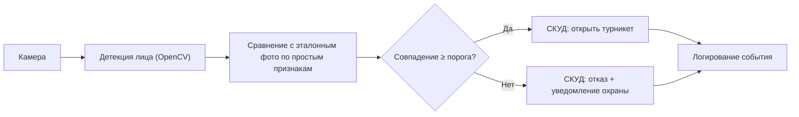
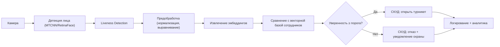

# AI_moderation_MLSD_Doc
## 1. Цели и предпосылки 
### 1.1. Зачем идем в разработку продукта?  

**Бизнес-цель**

- Автоматизировать процесс проверки личности сотрудников на проходных предприятия
- Исключить использование несанкционированного доступа на предприятие
- Повысить скорость и безопасность контроля доступа

**Почему станет лучше, чем сейчас, от использования ML**

- Мгновенная проверка личности по фото в реальном времени 24/7
- Возможность масштабировать решение на все проходные предприятия без увеличения штата охраны
- Последовательные, точные результаты — исключение человеческого фактора
- Раннее выявление попыток несанкционированного доступа
- Автоматическая фиксация нарушителей для дальнейшей передачи информации полиции или другим ведомствам 

**Критерии успеха проекта**

- Среднее время идентификации ≤ 1 сек. с момента попадания лица в зону камеры до принятия решения о доступе
- Точность ≥ 95%, минимизация ложных срабатываний (ошибочной идентификации посторонних как сотрудников)
- Сокращение времени проверки личности на проходной на 75% по сравнению с текущим ручным процессом
- Увеличение охвата автоматической проверки до ≥ 95% всех проходов через КПП

### 1.2. Бизнес-требования и ограничения  

**Функциональные требования**

- Распознавание лиц сотрудников: Доля корректных идентификаций ≥ 0.95
- Обнаружение попыток несанкционированного доступа: Доля выявленных попыток ≥ 0.9
- Интеграция с системой контроля доступа: Автоматическая передача результата идентификации в СКУД (система контроля и управления доступом)

**Нефункциональные требования**

- Скорость обработки: ≤ 1 сек. на идентификацию одного сотрудника
- Одновременная обработка: 20 потоков, имеютя в виду 10 проходных по две камеры на проходную, итого 20 потоков
- Доступность: система должна быть доступна ≥ 99.5% времени

**Ограничения**

- Соответствие требованиям ФСТЭК и ФСБ по защите информации
- Запрет на использование технологии для целей, не связанных с контролем доступа, конкретно иеется ввиду скрытая слежка за сотрудниками
- Запрет передачи биометрических данных третьим лицам
- Ограничение на хранение биометрических данных не более 90 дней
- Максимальная задержка распознования 7 сек.
- Ограничения по бюджету проекта 750.000 Российских рублей

**Что ожидаем от прототипа?**

- Базовый функционал распознавания лиц сотрудников по фото с камер на проходной
- Web-сервис для службы безопасности с отображением истории проходов и тревожных событий, а также live информации по сотруднику, который только что прошёл через проходную
- Интеграцию с системой контроля и управления доступом

### 1.3. Что ожидается от итерации?  

### 1.3.1 На закрытие каких БТ подписываемся в данной итерации

**Что будет закрыто** 

- Распознавание лиц сотрудников с точностью ≥ 0.95
- Обнаружение попыток несанкционированного доступа с уровнем выявления ≥ 0.9
- Обработка до 20 потоков видеопотока одновременно
- Интеграция с системой контроля и управления доступом
- Автоматическая фиксация и создание инцидента в системе безопасности при подозрительном событии
- Поддержка работы в условиях переменного освещения и погодных факторов
- Ведение журнала всех проходов с фотофиксацией для последующего аудита

**Что не будет закрыто** 

- Распознавание лиц в движении при высокой скорости прохода
- Детекция и предотвращение обхода системы, к примеру использование масок или фотос видео
- Мобильный интерфейс для службы безопасности
- Интеграция с системой учёта рабочего времени
- Поддержка мультифакторной аутентификации

### 1.3.2 Описание результата с точки зрения качества кода и воспроизводимости решения*

**Результат с точки зрения кода**

- Автоматическая проверка качества модели перед деплоем
- Использование Docker для контейнеризации всех компонентов системы
- Документирование API проекта
- Более 85% покрытия по Unit-тестам 

**Результат с точки зрения воспроизводимости решения**

- Полная документация по развертыванию системы на проходных предприятия
- Скрипты для подготовки и обновления базы эталонных изображений сотрудников
- Возможность отката модели к предыдущей версии при деградации качества
- Мониторинг метрик в Grafana/InfluxDB/Kibana или любой другой системе для контроля точности распознования, нагрузки на сервера и скорости обработки

### 1.3.3 Описание планируемого технического долга

**Технический долг**

- Реализовать проверку liveness detection для претовращения несанкционированного доступа на преприятие
- Внедрить автоматическое обновление и переобучение модели с постоянной проверкой качества
- Настроить резервирование БД и серверов
- Расширить интеграцию с другими системами предприятия
- Автоматизировать деплой и откат версий через CI/CD
- Оптимизировать алгоритмы обработки изображений для снижения задержек

#### 1.4. Предпосылки решения  

**Данные**

- **Основной источник:** видеопоток с камер на проходных
- **Эталонная база:** фотографии сотрудников из кадровой системы с метаданными (ФИО, табельный номер, отдел)
- **Дополнительные признаки:** время прохода, номер проходной, направление движения 

**Ключевые гипотезы**

- Использование комбинации видеопотока и эталонных фото позволит достичь точности идентификации ≥ 95%
- Внедрение модуля liveness detection снизит риск обхода системы с помощью фото/видео на 90%
- Предварительная обработка изображений повысит стабильность работы модели в условиях уличных проходных
- Хранение и обработка данных в локальной инфраструктуре предприятия обеспечит соответствие требованиям 152‑ФЗ и внутренним регламентам безопасности

**Горизонт прогноза**

- Идентификация в реальном времени без накопления очереди

### 2. Методология `Data Scientist`     

#### 2.1. Постановка задачи  

С технической точки зрения задача относится к верификации личности с элементами обнаружения аномалий, аномалией в даннном случае считаются неизвестные люди, подделки, попытки обхода система. Основным классом являются сотрудники, имеющие допуск. ключевыим метриками будут являтся Precision и Recall с точностью 95 и 90 процентов соответственно. Время отклика менее или равное одной секунде.

### 2.2 Бейзлайн 

**Особенности**

- Минимальная предобработка.
- Отсутствие liveness detection

### 2.2.1 MVP

**Особенности**

- Современные модели детекции и верификации лиц.
- liveness detection
- Локальная обработка данных для соблюдени 152-ФЗ
- огирование и аналитика для улучшения модели

### 3. Подготовка пилота  
  
#### 3.1. Способ оценки пилота  
  
 - **Дизайн эксперимента: Shadow/A-B rollout**

    - Режим тени: ML‑система работает параллельно текущему процессу проверки, то есть ручному, решения ML не влияют на доступ. Происходит мбор парных метрик для каждого прохода
    - A/B по проходным: 1 или 2 проходных переключаем в режим ML+оператор подтверждает, остальные отсавляем на ручной проверка как было. Проходные могут меняться каждый день или даже смену для сбора большего числа данных
    - Длительность 3 недели, чтобы охватить разные смены и условия освещённости и погоды
   
 - **Метрики качества распознавания**
    - False Accept Rate
    - False Reject Rate
    - Recall модели
    - Precision модели
    - Liveness TPR и FPR
 - **Эксплуатационные метрики**
    - Пропускная способность
    - Доля ручных проверок из всех процессов
    - Стабильность системы, имеется ввиду uptime и другие ошибки
  
#### 3.2. Что считаем успешным пилотом  

- **Технические критерии:**

    - Recall ≥ 0.98 для сотрудников в дневных условиях, ≥ 0.95 в сложных условиях
    - Liveness FPR ≤ 1% , TPR ≥ 98%
    - P99 латентность ≤ 1 сек
    - Аптайм сервиса ≥ 99.5%.
      
- **Бизнес критерии:**
  
    - Снижение времени прохода на 30% без роста очередей на пиковой нагрузке
    - Отсутствие инцидентов безопасности по итогам пилота
    - Положительная оценка службы безопасности, можно будет сделать при помощи простого опроса, положительной оценкой можно считать выше или равной 4

  
#### 3.3. Подготовка пилота  
  
- Что можем позволить себе, исходя из ожидаемых затрат на вычисления. Если исходно просчитать сложно, то описываем этап расчетов ожидаемой вычислительной сложности на эксперименте с бейзлайном. И предусматриваем уточнение параметров пилота и установку ограничений по вычислительной сложности моделей. `Data Scientist` 

### 4. Внедрение `для production систем, если требуется`    

> Заполнение раздела 4 требуется не для всех дизайн документов. В некоторых случаях результатом итерации может быть расчет каких-то значений, далее используемых в бизнес-процессе для пилота.  
  
#### 4.1. Архитектура решения   
  
- Блок схема и пояснения: сервисы, назначения, методы API `Data Scientist`  
  
#### 4.2. Описание инфраструктуры и масштабируемости 
  
- Какая инфраструктура выбрана и почему `Data Scientist` 
- Плюсы и минусы выбора `Data Scientist` 
- Почему финальный выбор лучше других альтернатив `Data Scientist` 
  
#### 4.3. Требования к работе системы  
  
- SLA, пропускная способность и задержка `Data Scientist`  
  
#### 4.4. Безопасность системы  
  
- Потенциальная уязвимость системы `Data Scientist`  
  
#### 4.5. Безопасность данных   
  
- Нет ли нарушений GDPR и других законов `Data Scientist`  
  
#### 4.6. Издержки  
  
- Расчетные издержки на работу системы в месяц `Data Scientist`  
  
#### 4.5. Integration points  
  
- Описание взаимодействия между сервисами (методы API и др.) `Data Scientist`  
  
#### 4.6. Риски  
  
- Описание рисков и неопределенностей, которые стоит предусмотреть `Data Scientist`   
  
> ### Материалы для дополнительного погружения в тему  
> - [Шаблон ML System Design Doc [EN] от AWS](https://github.com/eugeneyan/ml-design-docs) и [статья](https://eugeneyan.com/writing/ml-design-docs/) с объяснением каждого раздела  
> - [Верхнеуровневый шаблон ML System Design Doc от Google](https://towardsdatascience.com/the-undeniable-importance-of-design-docs-to-data-scientists-421132561f3c) и [описание общих принципов его заполнения](https://towardsdatascience.com/understanding-design-docs-principles-for-achieving-data-scientists-53e6d5ad6f7e).
> - [ML Design Template](https://www.mle-interviews.com/ml-design-template) от ML Engineering Interviews  
> - Статья [Design Documents for ML Models](https://medium.com/people-ai-engineering/design-documents-for-ml-models-bbcd30402ff7) на Medium. Верхнеуровневые рекомендации по содержанию дизайн-документа и объяснение, зачем он вообще нужен  
> - [Краткий Canvas для ML-проекта от Made with ML](https://madewithml.com/courses/mlops/design/#timeline). Подходит для верхнеуровневого описания идеи, чтобы понять, имеет ли смысл идти дальше.  
